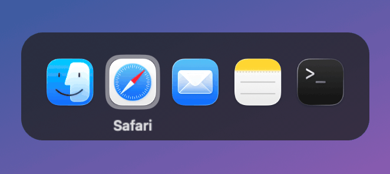
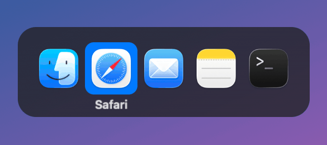
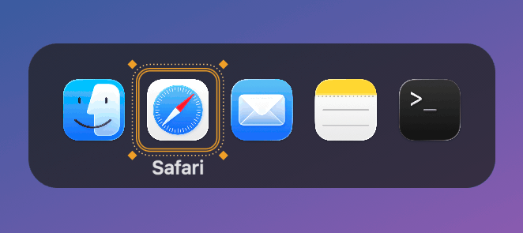
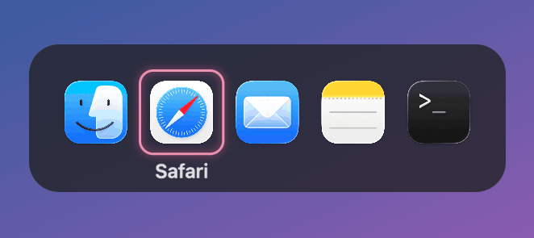
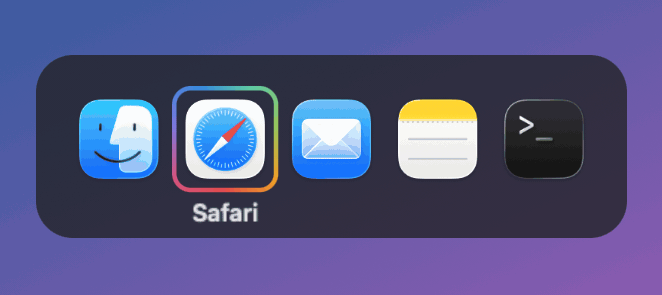
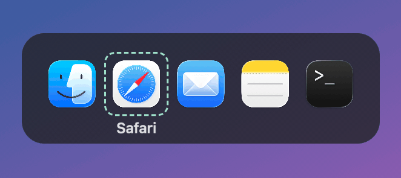
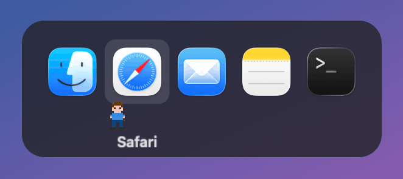
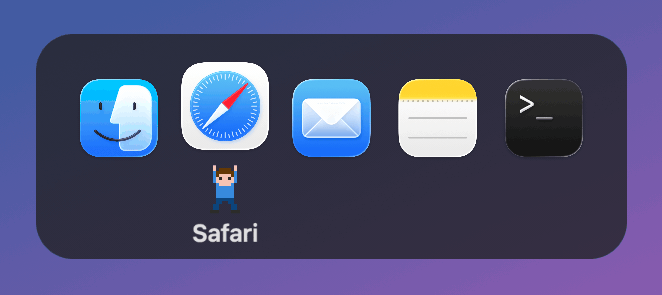
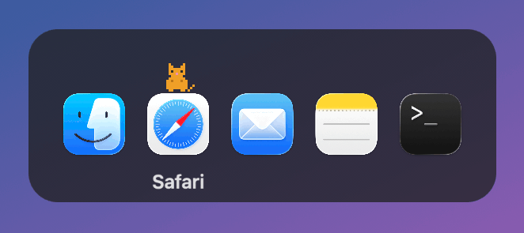

# MacTab

English | [简体中文](README.zh-CN.md)

A replacement for the macOS Cmd+Tab switcher. It looks and behaves like the built-in one, but leaves out apps that have no windows (like Finder after you close all its windows). Any app that still has a window is listed, including minimized and hidden windows and windows on other desktops.

MacTab is free and open source under the [MIT License](LICENSE), with no paid features. The interface is available in English and Simplified Chinese and follows your system language.

## Themes

Pick a selection theme in Settings:

<table>
  <tr>
    <td align="center"><br>Classic</td>
    <td align="center"><br>Accent</td>
    <td align="center"><br>Ornate</td>
  </tr>
  <tr>
    <td align="center"><br>Neon</td>
    <td align="center"><br>Rainbow</td>
    <td align="center"><br>Marching Ants</td>
  </tr>
  <tr>
    <td align="center"><br>Porter</td>
    <td align="center"><br>Lifter</td>
    <td align="center"><br>Hopping Cat</td>
  </tr>
</table>

## Install

Requires macOS 14 or later, on Apple silicon or Intel.

1. Download the latest `MacTab-x.y.z.dmg` from [Releases](https://github.com/gabrielsky/mac-tab/releases), open it, and drag MacTab into Applications.
2. The first time you open it, macOS says it can't verify the developer: MacTab is signed with a self-signed certificate and isn't notarized by Apple. Click Done, go to System Settings → Privacy & Security, scroll down to MacTab, and click Open Anyway.
3. On first launch MacTab asks for accessibility access. Turn on MacTab in System Settings → Privacy & Security → Accessibility. It takes effect immediately, no restart needed.

To upgrade, download the new version and replace the old one. You won't need to grant access again.

## Build from source

```bash
./scripts/build-app.sh
```

This builds MacTab and installs it to `~/Applications/MacTab.app`. See [CONTRIBUTING.md](CONTRIBUTING.md) for development notes.

## Usage

| Action | Result |
|---|---|
| Cmd+Tab / Cmd+Shift+Tab | Open the switcher and select the next / previous app |
| ← → while holding Cmd | Move the selection |
| Release Cmd | Switch to the selected app; if all its windows are minimized, one is restored |
| Esc | Cancel |
| Q / H | Quit / hide the selected app |
| Mouse move / click | Select / switch |

The menu bar icon has Settings… and Quit MacTab. In Settings you can:

- pick a selection theme, with a live preview;
- turn launch at login on or off;
- check accessibility access, and open System Settings if it's missing.

When Reduce Motion is on, all themes are shown without animation.

## Known limitations

- A few apps (Chrome, WeChat, etc.) leave stray popup windows behind, so they may still be listed after you close all their windows.
- Q and H in the switcher match physical key positions, so on non-QWERTY layouts they're different keys.

## License

[MIT](LICENSE)
